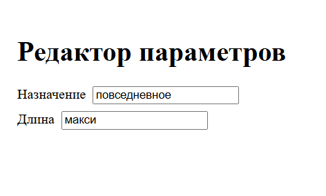

## Тестовое задание: Редактор параметров (React + TS + Git)

### Перейдите в папку проекта перед установкой зависимостей и запуском.

cd param-editor

### Установка:

npm install

### Запуск:

npm run dev

---

### Test:

npx vitest

---

### Стек:

- React

- TypeScript

- Vitest

- React Testing Library

---



---

```bash
$ npx vitest

PASS  src/ParamEditor.test.tsx (3 tests)
  ✓ renders inputs for all params (187ms)
  ✓ initializes values from model.paramValues (17ms)
  ✓ returns correct model from getModel after changes (19ms)

Test Files  1 passed (1)
Tests       3 passed (3)
Duration    1.89s
```


---
